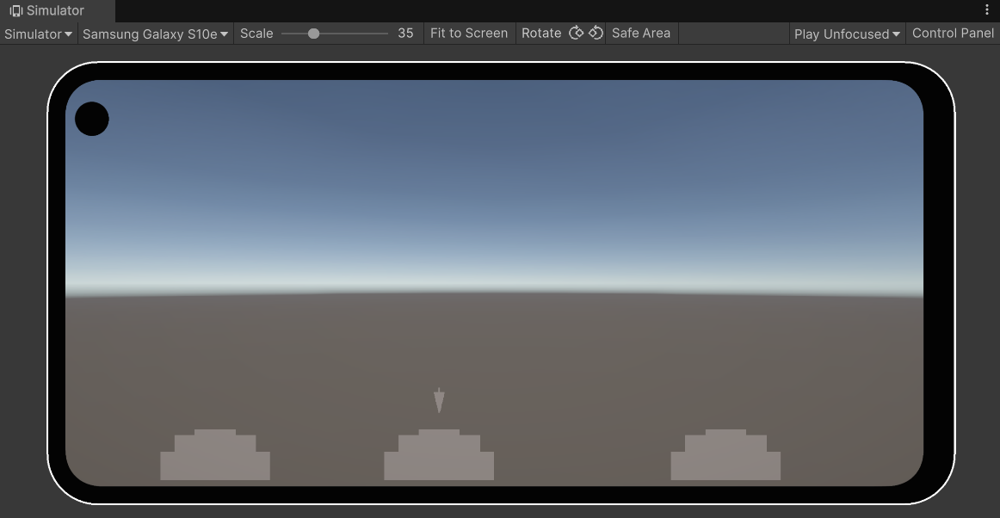
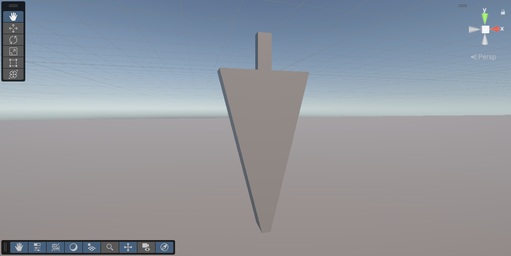
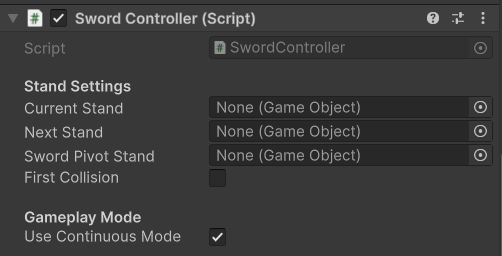
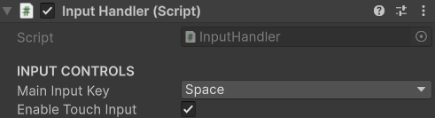
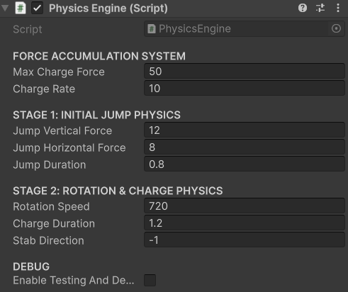
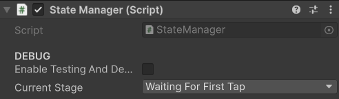
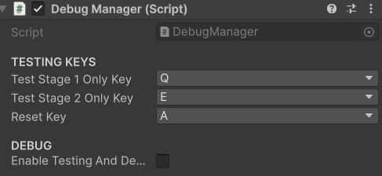

# Tap–Hold Action Starter (Sword Sample)

A compact, extensible **two-stage tap/hold action system** for Unity.  
Stage 1 = initial jump. Stage 2 = hold to charge + rotate, release to perform a strong “stab/impulse”.  
The modules are decoupled (input, state, physics), so you can swap the “sword” for anything (spear, drill, rocket punch).

---

## Demo (Sample Scene)



---

## What’s Included (Scripts)

- `BaseDebugComponent.cs` – base class to centralize debug toggles/logs.  
- `DebugManager.cs` – **test keys** and optional on-screen labels.  
- `Floor.cs` – resets physics/transform when the actor touches floor/stand.  
- `InputHandler.cs` – press/hold/release detection (keyboard + optional touch).  
- `PhysicsEngine.cs` – Stage 1 jump; Stage 2 rotation + charge + release impulse.  
- `Stand.cs` – detects valid stand hits; exposes the **pivot** (snap point) from the stand’s first child.  
- `StandProgression.cs` – validates stand order (only allow forward progression).  
- `StateManager.cs` – authoritative **GameStage** state machine.  
- `SwordController.cs` – **orchestrates** input → state → physics + stand logic.  
- `Utils.cs` – `GameStage` enum + small transform/physics utilities.

---

## Requirements

- Unity **6000.1+** (URP or Built-in; screenshots use URP).  
- New **Input System** package.  
- Actor GameObject (the “sword” sample) must have a **Rigidbody**.  
- Tag each stand **`Sword_Stand`** and ensure it has a **child at index 0** (pivot).

---

## Quick Start

1. **Create the Actor**  
   Add to your actor GameObject (with a `Rigidbody`):  
   **InputHandler**, **PhysicsEngine**, **StateManager**, **DebugManager** *(optional)*, **SwordController**.
   

   **SwordController (Inspector):**  
   

   **InputHandler (Inspector):**  
   

   **PhysicsEngine (Inspector):**  
   

   **StateManager (Inspector):**  
   

   **DebugManager (Inspector):**  
   

2. **Create Stands**  
   - Each stand: GameObject with collider + **Stand** component.  
   - **Tag** it `Sword_Stand`.  
   - Its **first child** is the **pivot** where the actor snaps after landing.  
   - Add **StandProgression** anywhere in the scene and list the stands in **forward order**.

3. **(Optional) Floor**  
   - Add **Floor** to ground colliders to reset/snap on contact.

4. **Play**  
   - **Classic:** Tap → Stage 1 (jump). Then tap/hold → Stage 2 (charge). Release → stab/impulse.  
   - **Continuous:** Hold during Stage 1; it auto-transitions to Stage 2 and releases on input up.  
     Toggle in **SwordController**: *Use Continuous Mode*.

---

## How It Works

- `InputHandler` fires **OnInputPressed/OnInputReleased**.  
- `SwordController` checks **StateManager** and drives **PhysicsEngine** to start Stage 1 or Stage 2.  
- While charging, **PhysicsEngine** accumulates force and rotates the actor; on release it applies an impulse.  
- On valid stand collision, the actor snaps to that stand’s **pivot**; **StandProgression** optionally enforces order.

**Core states (`GameStage`):**  
`WaitingForFirstTap → Stage1InProgress → WaitingForSecondTap → Stage2InProgress → Reset`

---

## Main Tunables

**InputHandler**  
- *Main Input Key* (default **Space**), *Enable Touch Input*.

**PhysicsEngine**  
- **Force Accumulation:** *Max Charge Force*, *Charge Rate*.  
- **Stage 1:** *Jump Vertical Force*, *Jump Horizontal Force*, *Jump Duration*.  
- **Stage 2:** *Rotation Speed* (deg/s), *Charge Duration*, *Stab Direction* (e.g., `-1` for local -Y).

**SwordController**  
- **Stand Settings:** *Current Stand*, *Next Stand*, *Sword Pivot Stand*.  
- **Gameplay Mode:** *Use Continuous Mode*.

**DebugManager**  
- Default keys: **Q** (Stage 1 test), **E** (Stage 2 test; hold/release), **A** (Reset).

---

## Integration Notes

- Keep the stand **pivot** (child index 0) aligned to where the actor should rest.  
- If the actor feels too floaty, increase `Rigidbody.mass` or reduce Stage 1 vertical force.  
- For older Unity versions, replace `linearVelocity/linearDamping` with `velocity/drag` in helpers.

---

```text
┌─────────────────────────────────────────────────────────────────┐
│                        SWORD PHYSICS SYSTEM                     │
└─────────────────────────────────────────────────────────────────┘

                        ┌─────────────────────┐
                        │   SwordController   │
                        │   (COORDINATOR)     │
                        ├─────────────────────┤
                        │ - inputHandler      │
                        │ - physicsEngine     │
                        │ - stateManager      │
                        │ + rb: Rigidbody     │
                        ├─────────────────────┤
                        │ + StartStage1()     │
                        │ + StartStage2()     │
                        │ + ResetToInitial()  │
                        └─────────┬───────────┘
                                  │
        ┌─────────────────────────┼─────────────────────────┐
        │                         │                         │
        ▼                         ▼                         ▼
┌─────────────────────┐ ┌─────────────────────┐ ┌─────────────────────┐
│   InputHandler      │ │   PhysicsEngine     │ │   StateManager      │
│     (INPUT)         │ │     (PHYSICS)       │ │     (STATE)         │
├─────────────────────┤ ├─────────────────────┤ ├─────────────────────┤
│ + IsInputHeld       │ │ + IsCharging        │ │ + CurrentStage      │
│ + OnInputPressed    │ │ + StabForce         │ │ + OnStateChanged    │
│ + OnInputReleased   │ │ + OnStageComplete   │ ├─────────────────────┤
└─────────────────────┘ ├─────────────────────┤ │ + SetState()        │
                        │ + ExecuteStage1()   │ │ + CanStartStage1()  │
                        │ + ExecuteStage2()   │ │ + CanStartStage2()  │
                        │ + StopCharging()    │ └─────────────────────┘
                        └─────────────────────┘

┌─────────────────────┐  ┌─────────────────────┐  ┌─────────────────────┐
│   DebugManager      │  │      GameStage      │  │       Utils         │
│     (DEBUG)         │  │      (ENUM)         │  │    (HELPERS)        │
├─────────────────────┤  ├─────────────────────┤  ├─────────────────────┤
│ - swordController   │  │ WaitingForFirstTap  │  │ PhysicsUtils        │
├─────────────────────┤  │ Stage1InProgress    │  │ TransformUtils      │
│ + ForceReset()      │  │ WaitingForSecondTap │  │ DebugUtils          │
│ + TestStage1()      │  │ Stage2InProgress    │  └─────────────────────┘
│ + TestStage2()      │  │ StabAttack          │
└─────────────────────┘  │ Reset               │
                         └─────────────────────┘
```
## Anti-patterns avoided

### God class

* Don’t make `SwordController` inherit input/state/physics—this creates a God class and tight coupling.
* We use **composition over inheritance**: `SwordController` only orchestrates; input/state/physics stay in separate components with **small APIs**. This keeps SRP, prevents controller bloat, and lets you swap/extend modules safely.

### Circular references

* **Bidirectional links** (A ↔ B) create circular deps: fragile init order, hidden side-effects, and event/memory leaks.
* We enforce a **one-way flow**: Input → Controller → State -> Physics, with feedback as **events to the controller only**. Modules never reference each other or the controller, keeping the graph acyclic and testable.

### TechStack: Unity 6 • C# • Blender • URP • Input System
---

## Changelog

- **1.0.0** — Initial release (sample scene, two-stage action system, stand progression, debug tools).

---
